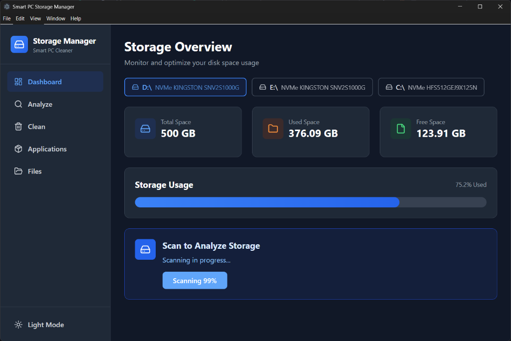

# 🚀 Storage Cleaner Assistant

[](https://www.electronjs.org/)
[](https://reactjs.org/)
[](https://vitejs.dev/)
[](https://www.typescriptlang.org/)
[](https://tailwindcss.com/)

A powerful, cross-platform desktop application designed to help you regain control over your system storage. The **Storage Manager Dashboard** intelligently scans your drives, identifies space-wasting files, and provides safe, actionable cleanup recommendations.



---

## ✨ Key Features

### 🔍 Deep Storage Scanning
- **Recursive Traversal:** Thoroughly scans directories with real-time progress updates.
- **Categorization:** Automatically groups files into Documents, Images, Videos, Audio, Archives, and Code.
- **Exclusion Lists:** Pre-configured to skip critical system directories for safety.

### 🧠 Intelligent Analysis
- **Large File Detection:** Quickly find massive files that are eating up your disk space.
- **Duplicate Finder:** Detects potential duplicates by name and size, with **SHA-256 hash verification** for 100% accuracy.
- **Old File identification:** Highlights files that haven't been accessed in months.

### 📦 Application Management
- **Cross-Platform Detection:** Lists installed applications on Windows, macOS, and Linux.
- **Usage Tracking:** Classifies apps based on their last use (Frequent, Occasional, Rare, Never).
- **Size Calculation:** Shows exactly how much space each application is consuming.

### 💡 Smart Recommendations
- **Safety First:** Recommendations are categorized by safety levels (SAFE, CAUTION, ADVANCED).
- **One-Click Cleanup:** Easily select and remove recommended items.
- **Estimated Recovery:** See exactly how much space you'll gain before you delete anything.

### 🛡️ Safe Deletion System
- **Recycle Bin Integration:** Files are moved to the system recycle bin/trash for easy recovery.
- **Permanent Deletion:** Option for irreversible deletion with extra confirmation.
- **Protected Paths:** Built-in safeguards prevent the accidental deletion of system-critical files.

---

## 🛠️ Tech Stack

- **Core:** [Electron](https://www.electronjs.org/) (Desktop Environment)
- **Frontend:** [React](https://reactjs.org/) with [TypeScript](https://www.typescriptlang.org/)
- **Build Tool:** [Vite](https://vitejs.dev/)
- **Styling:** [Tailwind CSS](https://tailwindcss.com/)
- **Icons:** [Lucide React](https://lucide.dev/)
- **State Management:** React Context API
- **Data Persistence:** [Supabase](https://supabase.com/) (Optional/Integration ready)

---

## 🚀 Getting Started

### Prerequisites
- [Node.js](https://nodejs.org/) (v18 or higher recommended)
- npm or yarn

### Installation

1. **Clone the repository:**
   ```bash
   git clone https://github.com/advait-vikas/Storage_Cleaner_Assistant.git
   cd Storage_Cleaner_Assistant
   ```

2. **Install dependencies:**
   ```bash
   npm install
   ```

### Running in Development

To start the application in development mode with hot-reloading:

```bash
npm run electron:dev
```

### Building for Production

To create a production-ready build:

```bash
npm run build
npm run electron:start
```

---

## 📂 Project Structure

```text
├── src/
│   ├── appScanner.cjs         # Application detection logic
│   ├── storageScanner.cjs     # File system scanning engine
│   ├── recommendationEngine.cjs # Intelligent cleanup logic
│   ├── fileDeletion.cjs       # Safe deletion handlers
│   ├── contexts/              # React Context (AppContext.tsx)
│   ├── pages/                 # Dashboard, Analyze, Clean, Applications, Files
│   ├── types/                 # TypeScript interfaces and types
│   ├── main.cjs               # Electron main process
│   └── preload.js             # Electron preload script (IPC Bridge)
├── public/                    # Static assets
└── index.html                 # App entry point
```

---

## 🗺️ Roadmap & Future Enhancements

- [ ] **Worker Threads:** Move scanning to background threads for zero UI lag.
- [ ] **Incremental Scanning:** Only scan changed files to speed up subsequent runs.
- [ ] **Scheduled Scans:** Automatically prompt for cleanup at set intervals.
- [ ] **Cloud Sync:** Backup cleanup history and settings to Supabase.
- [ ] **Browser Integration:** Detect and clean browser-specific cache and temporary files.

---

## 📄 License

This project is licensed under the MIT License - see the [LICENSE](LICENSE) file for details.

---

## 🤝 Contributing

Contributions are welcome! Please feel free to submit a Pull Request.

---

Created with ❤️ by [Advait Vikas](https://github.com/advait-vikas)
